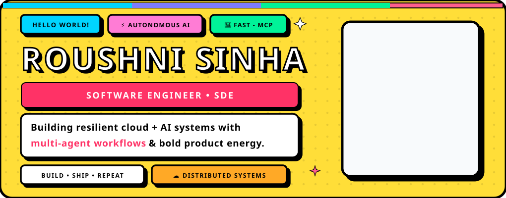

<div align="center">

<!-- ⚪⚫ POKÉMON-INSPIRED SPARKLING MONOCHROME BANNER -->


<br/>

<!-- TRAINER STATUS BADGES -->
<p align="center">
  
  
  
  
</p>

<!-- DYNAMIC INTRO -->


<p align="center">
  <a href="https://www.linkedin.com/in/roushni-sinha-486364204">
    
  </a>
  &nbsp;&nbsp;
  <a href="mailto:roushnisinha111@gmail.com">
    
  </a>
  &nbsp;&nbsp;
  <a href="https://github.com/RoushniSinha/RoushniSinha.github.io">
    
  </a>
</p>

</div>

---

## ⚪⚫ About Me (Trainer Profile)

Hello! I’m an **Emerging Technology Expert & Software Engineer** specializing in autonomous AI systems, low-latency distributed backends, and cloud platforms.

- 🎓 Completed my **Master of Computer Applications (MCA '26)** at **Patna Women's College (PWC)**.
- 🏰 Live Portfolio: **[Roushni's Portfolio](https://github.com/RoushniSinha/RoushniSinha.github.io)**
- ⚡ **Current Mission:** Building FastMCP tools, resilient distributed backends, and multi-agent systems with human-in-the-loop safeguards.

---

## 📄 Live Interactive Resume

<div align="center">
  
</div>

---
---


---

## 🐍 Contribution Snake (Animated)

<div align="center">
  <picture>
    <source media="(prefers-color-scheme: dark)" srcset="https://raw.githubusercontent.com/RoushniSinha/RoushniSinha/output/github-contribution-grid-snake-dark.svg" />
    <source media="(prefers-color-scheme: light)" srcset="https://raw.githubusercontent.com/RoushniSinha/RoushniSinha/output/github-contribution-grid-snake.svg" />
    
  </picture>
</div>

---

## 🏟️ Pokémon League Projects (Featured Flagships)

<table>
  <tr>
    <td width="50%" valign="top">
      <h3>
        ⚪
        🥇 Gym 1: AegisOps
      </h3>
      <p><b>Autonomous B2B Logistics Multi-Step Orchestrator</b></p>
      <p>Autonomous load reassignment engine with Gemini function calling, an immutable Firestore ledger, and human-in-the-loop circuit breakers.</p>
      <p><b>Move Set:</b> <code>Gemini 1.5</code> • <code>FastMCP</code> • <code>Cloud Run</code> • <code>Firestore</code> • <code>OpenTelemetry</code></p>
      <p>
        <a href="https://github.com/RoushniSinha?tab=repositories"><b>🔗 View Repository</b></a>
      </p>
    </td>
    <td width="50%" valign="top">
      <h3>
        ⚪
        🥈 Gym 2: Adaptive Model Router
      </h3>
      <p><b>MCP-Compliant Dynamic Inference Routing Agent</b></p>
      <p>Dynamic routing agent evaluating semantic complexity, context sizing, and token throughput between SLMs and frontier LLMs.</p>
      <p><b>Move Set:</b> <code>PyTorch</code> • <code>FastMCP</code> • <code>Transformers</code> • <code>Redis</code> • <code>Python</code></p>
      <p>
        <a href="https://github.com/RoushniSinha?tab=repositories"><b>🔗 View Repository</b></a>
      </p>
    </td>
  </tr>
  <tr>
    <td width="50%" valign="top">
      <h3>
        ⚪
        🥉 Gym 3: TravelBus Platform
      </h3>
      <p><b>High-Concurrency Inter-City Booking Platform</b></p>
      <p>Full-stack reservation platform supporting 1,000+ concurrent users with optimistic locking and HMAC-SHA256 webhook verification.</p>
      <p><b>Move Set:</b> <code>React.js</code> • <code>Node.js</code> • <code>MongoDB Atlas</code> • <code>Firebase</code> • <code>Razorpay</code></p>
      <p>
        <a href="https://github.com/RoushniSinha?tab=repositories"><b>🔗 View Repository</b></a>
      </p>
    </td>
    <td width="50%" valign="top">
      <h3>
        ⚪
        🔬 Gym 4: Telemetry Pipeline
      </h3>
      <p><b>Distributed Observability & Trace Analysis Engine</b></p>
      <p>Automated pipeline parsing 5,000+ daily logs and traces into structured OpenTelemetry schemas using containerized models.</p>
      <p><b>Move Set:</b> <code>Python</code> • <code>Llama 3.2</code> • <code>Hugging Face</code> • <code>Docker</code> • <code>FastAPI</code></p>
      <p>
        <a href="https://github.com/RoushniSinha?tab=repositories"><b>🔗 View Repository</b></a>
      </p>
    </td>
  </tr>
  <tr>
    <td width="50%" valign="top">
      <h3>
        ⚪
        🤖 Gym 5: CNCF-Architect Pro
      </h3>
      <p><b>Autonomous Repository Analysis Multi-Agent Framework</b></p>
      <p>Multi-agent AI architecture scanning repositories to synthesize deployment configurations, architectural trade-offs, and dependency graphs.</p>
      <p><b>Move Set:</b> <code>Next.js</code> • <code>Gemini 1.5 Flash</code> • <code>Supabase</code> • <code>TypeScript</code> • <code>Vercel</code></p>
      <p>
        <a href="https://github.com/RoushniSinha?tab=repositories"><b>🔗 View Repository</b></a>
      </p>
    </td>
    <td width="50%" valign="top">
      <h3>
        ⚪
        ⚡ Gym 6: QuickAI Platform
      </h3>
      <p><b>Full-Stack AI Multi-Service Content Studio SaaS</b></p>
      <p>End-to-end generative content platform integrating Clerk authentication, managed media pipelines, and scalable subscription flows.</p>
      <p><b>Move Set:</b> <code>React.js</code> • <code>Node.js</code> • <code>Clerk Auth</code> • <code>Cloudinary</code> • <code>Stripe</code></p>
      <p>
        <a href="https://github.com/RoushniSinha?tab=repositories"><b>🔗 View Repository</b></a>
      </p>
    </td>
  </tr>
</table>

---

## 🧰 Move Inventory (Technical Stack)

```ini
[Frontend & Web Modules]
Languages         = TypeScript, JavaScript (ES6+), Java, Python, HTML5, CSS3
Frameworks        = React.js, Next.js, Tailwind CSS, MERN Stack
Backend & APIs    = Node.js, Express.js, Java Backend, REST APIs, Webhooks

[Database & Concurrency Blocks]
Databases         = MongoDB Atlas, PostgreSQL, Firebase Firestore, Supabase, Redis
Core Foundations  = Data Structures & Algorithms (DSA), System Design, Concurrency

[Cloud & AI Systems]
Cloud Platforms   = Google Cloud Platform (GCP), Microsoft Azure, Vercel
Agentic AI        = FastMCP, ReAct Loops, Gemini Function Calling, PyTorch, Transformers
DevOps & Tooling  = Docker, Kubernetes, GitHub Actions CI/CD, Git, Linux
Telemetry         = OpenTelemetry, Distributed Tracing, Blockchain Architecture


```


## 🏆 League Trophies & Official Recognitions

<table>
  <tr>
    <td width="55%" valign="top">
      <h4>⭐ Verified Honors, Fellowships &amp; Certifications</h4>
      <ul>
        <li>
          <b>Google Cloud Gen AI Academy APAC (Cohort 2):</b> Selected and completed advanced generative AI tracks powered by Hack2skill and Google Cloud, mastering LLM codelabs, cloud deployment, and agent frameworks.
        </li>
        <li>
          <b>Google Developer Community Contributor:</b> Proud recipient of official Google goodies and awards for active contributions across technical developer challenges, open hackathons, and community programs.
        </li>
        <li>
          <b>Handshake AI Fellowship (Project Dynamo):</b> Selected as an AI Evaluation Task Author to architect deterministic CLI tool benchmarks on Terminal-Bench 2.
        </li>
        <li>
          <b>All Things Agentic Hackathon:</b> Engineered and submitted <i>AegisOps</i>, an autonomous multi-carrier logistics orchestrator built with Gemini 3.5 Flash and Cloud Run.
        </li>
        <li>
          <b>Infosys Springboard Pragati (Cohort 9):</b> Selected for the comprehensive enterprise cloud architecture and distributed full-stack upskilling track.
        </li>
        <li>
          <b>Microsoft Elevate (AICTE):</b> Completed Emerging Technologies engineering internship focusing on Azure cloud microservices and ML deployment.
        </li>
        <li>
          <b>IBM SkillsBuild &amp; Edunet Foundation:</b> Awarded credentials in Artificial Intelligence &amp; Machine Learning with open-source Llama models.
        </li>
        <li>
          <b>NIELIT Patna Bootcamp:</b> Certified in Enterprise Cybersecurity, secure network protocols, and threat mitigation frameworks.
        </li>
      </ul>
    </td>
    <td width="45%" align="center" valign="middle">
      
      <br/><br/>
      <sub><b>Google Cloud &amp; Community Recognition</b><br/>Official contributor swag, rewards, and program milestones.</sub>
    </td>
  </tr>
</table>

---

## 🟢 Trainer Network (Connect)

<div align="center">

<p>
  <a href="https://www.linkedin.com/in/roushni-sinha-486364204">
    
  </a>
  &nbsp;&nbsp;
  <a href="https://twitter.com/roushni_sinha">
    
  </a>
  &nbsp;&nbsp;
  <a href="mailto:roushnisinha111@gmail.com">
    
  </a>
  &nbsp;&nbsp;
  <a href="https://github.com/RoushniSinha/RoushniSinha.github.io">
    
  </a>
</p>

<!-- MONOCHROME THEMED FOOTER -->


</div>
